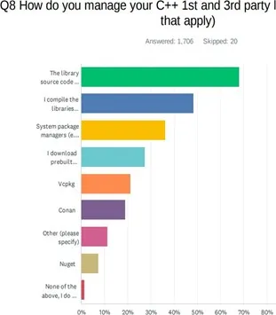

# Hello program
This is a demo program for learning how to build and release

# Package Manager



https://vcpkg.io

# CMake: A Powerful Software Build System

- CMake uses a toolchain of utilities to compile, link libraries and create archives, and other tasks to drive the build. The toolchain utilities available are determined by the languages enabled. In normal builds, CMake automatically determines the toolchain for host builds based on system introspection and defaults. In cross-compiling scenarios, a toolchain file may be specified with information about compiler and utility paths.

- CMake is a tool to manage building of source code. Originally, CMake was designed as a generator for various dialects of Makefile, today CMake generates modern buildsystems such as Ninja as well as project files for IDEs such as Visual Studio and Xcode.
- CMake is widely used for the C and C++ languages, but it may be used to build source code of other languages too.


# DEMO

## Prerequisites

- vcpkg
- clang
- cmake
- ...

## Present 

- static
- dynamic

```bash
export PRESENT=static
```
## Configuration base on CmakePresents.json

```bash
make conf 
```

## Build
```bash
make build
```
## Dep
```bash
make deps
```

## Run
```bash
make run
```

## Size
```bash
make size
```

## Clear
```bash
make run
```
## Release

### github
https://github.com/thienma1258/hello-world/releases/tag/0.1.0
### vcpkg


# Addition


In Darwin, much is built into the system library, /usr/lib/libSystem.dyli,/usr/lib/libc++.1.dylib

- `libc` 
The standard C library. This library contains the functions used by C programmers on all platforms.The runtime library is basically a collection of the implementations of those functions in one big file (or a few big files--e.g., on UNIX the floating point functions are traditionally stored separately from the rest).

- `libinfo` 
The NetInfo library.

- `libkvm`
The kernel virtual memory library.

- `libm`
The math library, which contains arithmetic functions.

- `libpthread`
The POSIX threads library, which allows multiple tasks to run concurrently within a single program.

- `libc++1.dylib` 
The standard C++ library.

