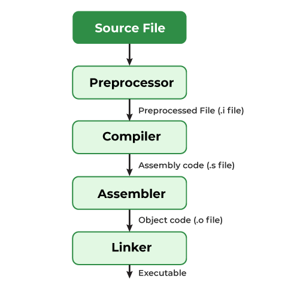

# Hello program
This is a basic program for learning how to build and release




A compiler converts a C++ program into an executable. There are four phases for a C program to become an executable: 

- Pre-processing
- Compilation
- Assembly
- Linking


# CMake: A Powerful Software Build System

CMake is the de-facto standard for building C++ code, with over 2 million downloads a month. It’s a powerful, comprehensive solution for managing the software build process. Get everything you need to successfully leverage CMake by visiting our resources section.

# Package Manager


https://vcpkg.io

# Runtime Manager

C++ runtime enviroment : libcmt is (one of several) implementations of the C standard library provided with Microsoft's compiler. The runtime library is basically a collection of the implementations of those functions in one big file (or a few big files--e.g., on UNIX the floating point functions are traditionally stored separately from the rest).

- `libc++` 
The standard C++ library. This library contains the functions used by C++ programmers on all platforms.

 /usr/lib/libSystem.dylib

- `libinfo` 
The NetInfo library.

- `libkvm`
The kernel virtual memory library.

- `libm`
The math library, which contains arithmetic functions.

- `libpthread`
The POSIX threads library, which allows multiple tasks to run concurrently within a single program.

# cmake

- CMake is the de-facto standard for building C++ code, with over 2 million downloads a month. It’s a powerful, comprehensive solution for managing the software build process.

- CMake uses a toolchain of utilities to compile, link libraries and create archives, and other tasks to drive the build. The toolchain utilities available are determined by the languages enabled. In normal builds, CMake automatically determines the toolchain for host builds based on system introspection and defaults. In cross-compiling scenarios, a toolchain file may be specified with information about compiler and utility paths.

# DEMO

## Prerequisites

- vcpkg
- clang
- cmake
- xcode
- ...

## Present 

- static
- dynamic

```bash
export PRESENT=static
```
## Configuration base on CmakePresents.json

```bash
make conf 
```

## Build
```bash
make build
```
## Dep
```bash
make deps
```

## Run
```bash
make run
```

## Size
```bash
make size
```

## Clear
```bash
make run
```
## Release

### github


### vcpkg